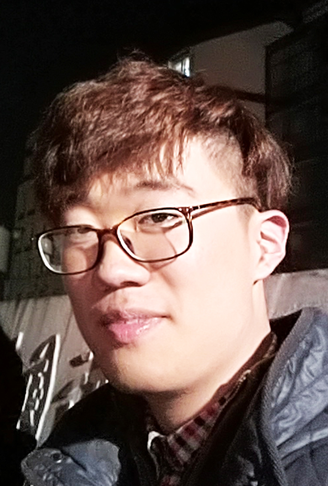

# About Us

We are a team based in the [School of Computing, National University of Singapore](http://www.comp.nus.edu.sg).

## Project Team

#### [Wang Zexin](https://github.com/wangzexin)
 
Role: Developer  
Responsibilities: Testing, backup for Integration and Code quality, in charge of Commons

-----

#### [Yan Xiaoxuan][Matilda-Yxx](https://github.com/Matilda-Yxx)
 
Role: Developer  

* Components in charge of: [UI](https://github.com/se-edu/addressbook-level4/blob/master/docs/DeveloperGuide.md#UI-component)
* Aspects/tools in charge of: GUITesting, SceneBuilder, Documentation
* Features implemented:
   * [List persons](https://github.com/se-edu/addressbook-level4/blob/master/docs/UserGuide.md#listing-all-persons--list)
   * [Delete person](https://github.com/se-edu/addressbook-level4/blob/master/docs/UserGuide.md#deleting-a-person--delete)
* Code written: [[functional code](A0147996E.md)][[test code](A0147996E.md)]
* Other major contributions:
  * Update UserGuide and Developer Guide [[#133](https://github.com/se-edu/addressbook-level4/pull/152) ]

-----

#### [Jong Xue Min Shermine Ruth](https://github.com/ShermineJong)
 
Role: Developer  
Responsibilities: Scheduling and deadlines checking, in charge of Logic and Storage

-----

#### [Mou Ziyang](http://github.com/mouziyanglovestudy)
 
Role: Developer  
Responsibilities: Integration and Code quality, in charge of Model

-----

# Contributors

We welcome contributions. See [Contact Us](ContactUs.md) page for more info.

* [Damith C. Rajapakse](http://www.comp.nus.edu.sg/~damithch)
