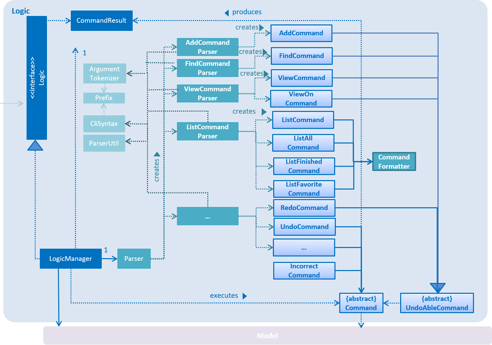

# Dueue - Developer Guide

By : `Team SE-EDU`  &nbsp;&nbsp;&nbsp;&nbsp; Since: `Feb 2017`  &nbsp;&nbsp;&nbsp;&nbsp; Licence: `MIT`

---

1. [Setting Up](#1-setting-up)
2. [Design](#2-design)
3. [Implementation](#3-implementation)
4. [Testing](#4-testing)
5. [Dev Ops](#5-dev-ops)

* [Appendix A: User Stories](#appendix-a--user-stories)
* [Appendix B: Use Cases](#appendix-b--use-cases)
* [Appendix C : Product Survey](#appendix-c--product-survey)

## 1. Setting up

### 1.1. Prerequisites

1. **JDK `1.8.0_60`**  or later 

    > Having any Java 8 version is not enough.  
    This app will not work with earlier versions of Java 8.

2. **Eclipse** IDE
3. **e(fx)clipse** plugin for Eclipse (Do the steps 2 onwards given in
   [this page](http://www.eclipse.org/efxclipse/install.html#for-the-ambitious))
4. **Buildship Gradle Integration** plugin from the Eclipse Marketplace
5. **Checkstyle Plug-in** plugin from the Eclipse Marketplace

### 1.2. Importing the project into Eclipse

0. Fork this repo, and clone the fork to your computer
1. Open Eclipse (Note: Ensure you have installed the **e(fx)clipse** and **buildship** plugins as given
   in the prerequisites above)
2. Click `File` > `Import`
3. Click `Gradle` > `Gradle Project` > `Next` > `Next`
4. Click `Browse`, then locate the project's directory
5. Click `Finish`

  > * If you are asked whether to 'keep' or 'overwrite' config files, choose to 'keep'.
  > * Depending on your connection speed and server load, it can even take up to 30 minutes for the set up to finish
      (This is because Gradle downloads library files from servers during the project set up process)
  > * If Eclipse auto-changed any settings files during the import process, you can discard those changes.

### 1.3. Configuring Checkstyle
1. Click `Project` -> `Properties` -> `Checkstyle` -> `Local Check Configurations` -> `New...`
2. Choose `External Configuration File` under `Type`
3. Enter an arbitrary configuration name e.g. taskManager
4. Import checkstyle configuration file found at `config/checkstyle/checkstyle.xml`
5. Click OK once, go to the `Main` tab, use the newly imported check configuration.
6. Tick and select `files from packages`, click `Change...`, and select the `resources` package
7. Click OK twice. Rebuild project if prompted

> Note to click on the `files from packages` text after ticking in order to enable the `Change...` button

### 1.4. Troubleshooting project setup

**Problem: Eclipse reports compile errors after new commits are pulled from Git**

* Reason: Eclipse fails to recognize new files that appeared due to the Git pull.
* Solution: Refresh the project in Eclipse: 
  Right click on the project (in Eclipse package explorer), choose `Gradle` -> `Refresh Gradle Project`.

**Problem: Eclipse reports some required libraries missing**

* Reason: Required libraries may not have been downloaded during the project import.
* Solution: [Run tests using Gradle](UsingGradle.md) once (to refresh the libraries).

## 2. Design

### 2.1. Architecture

 
_Figure 2.1.1 : Architecture Diagram_

The **_Architecture Diagram_** given above explains the high-level design of the App.
Given below is a quick overview of each component.

> Tip: The `.pptx` files used to create diagrams in this document can be found in the [diagrams](diagrams/) folder.
> To update a diagram, modify the diagram in the pptx file, select the objects of the diagram, and choose `Save as picture`.

`Main` has only one class called [`MainApp`](../src/main/java/seedu/address/MainApp.java). It is responsible for,

* At app launch: Initializes the components in the correct sequence, and connects them up with each other.
* At shut down: Shuts down the components and invokes cleanup method where necessary.

[**`Commons`**](#common-classes) represents a collection of classes used by multiple other components.
Two of those classes play important roles at the architecture level.

* `EventsCenter` : This class (written using [Google's Event Bus library](https://github.com/google/guava/wiki/EventBusExplained))
  is used by components to communicate with other components using events (i.e. a form of _Event Driven_ design)
* `LogsCenter` : Used by many classes to write log messages to the App's log file.

The rest of the App consists of four components.

* [**`UI`**](#ui-component) : The UI of the App.
* [**`Logic`**](#logic-component) : The command executor.
* [**`Model`**](#model-component) : Holds the data of the App in-memory.
* [**`Storage`**](#storage-component) : Reads data from, and writes data to, the hard disk.

Each of the four components

* Defines its _API_ in an `interface` with the same name as the Component.
* Exposes its functionality using a `{Component Name}Manager` class.

For example, the `Logic` component (see the class diagram given below) defines it's API in the `Logic.java`
interface and exposes its functionality using the `LogicManager.java` class. 
 
_Figure 2.1.2 : Class Diagram of the Logic Component_

#### Events-Driven nature of the design

The _Sequence Diagram_ below shows how the components interact for the scenario where the user issues the
command `delete 1`.

 
_Figure 2.1.3a : Component interactions for `delete 1` command (part 1)_

>Note how the `Model` simply raises a `TaskManagerChangedEvent` when the Task Manager data are changed,
 instead of asking the `Storage` to save the updates to the hard disk.

The diagram below shows how the `EventsCenter` reacts to that event, which eventually results in the updates
being saved to the hard disk and the status bar of the UI being updated to reflect the 'Last Updated' time.  
 
_Figure 2.1.3b : Component interactions for `delete 1` command (part 2)_

> Note how the event is propagated through the `EventsCenter` to the `Storage` and `UI` without `Model` having
  to be coupled to either of them. This is an example of how this Event Driven approach helps us reduce direct
  coupling between components.

The sections below give more details of each component.

### 2.2. UI component

Author: Yan Xiaoxuan

 
_Figure 2.2.1 : Structure of the UI Component_

**API** : [`Ui.java`](../src/main/java/seedu/address/ui/Ui.java)

The UI consists of a `MainWindow` that is made up of parts e.g.`CommandBox`, `ResultDisplay`, `TagListPanel`, `TaskListPanel`, `StatusBarFooter` etc. All these, including the `MainWindow`, inherit from the abstract `UiPart` class.

The `UI` component uses JavaFx UI framework. The layout of these UI parts are defined in matching `.fxml` files
 that are in the `src/main/resources/view` folder. 
 For example, the layout of the [`MainWindow`](../src/main/java/seedu/address/ui/MainWindow.java) is specified in
 [`MainWindow.fxml`](../src/main/resources/view/MainWindow.fxml)

The `UI` component,

* Executes user commands using the `Logic` component.
* Binds itself to some data in the `Model` so that the UI can auto-update when data in the `Model` change.
* Responds to events raised from various parts of the App and updates the UI accordingly.

### 2.3. Logic component

Author: Shermine Jong and Wang Zexin

 
_Figure 2.3.1 : Structure of the Logic Component_

**API** : [`Logic.java`](../src/main/java/seedu/address/logic/Logic.java)

1. `Logic` uses the `Parser` class to parse the user command.
2. This results in a `Command` object which is executed by the `LogicManager`.
3. The command execution can affect the `Model` (e.g. adding a Task) and/or raise events.
4. The result of the command execution is encapsulated as a `CommandResult` object which is passed back to the `Ui`.

Given below is the Sequence Diagram for interactions within the `Logic` component for the `execute("delete 1")`
 API call. 
 
_Figure 2.3.1 : Interactions Inside the Logic Component for the `delete 1` Command_

### 2.4. Model component

Author: Mou Ziyang

 
_Figure 2.4.1 : Structure of the Model Component_

**API** : [`Model.java`](../src/main/java/seedu/address/model/Model.java)

The `Model`,

* stores a `UserPref` object that represents the user's preferences.
* stores the Address Book data.
* exposes a `UnmodifiableObservableList<ReadOnlyTask>` that can be 'observed' e.g. the UI can be bound to this list
  so that the UI automatically updates when the data in the list change.
* does not depend on any of the other three components.

### 2.5. Storage component

Author: Shermine Jong

 
_Figure 2.5.1 : Structure of the Storage Component_

**API** : [`Storage.java`](../src/main/java/seedu/address/storage/Storage.java)

The `Storage` component,

* can save `UserPref` objects in json format and read it back.
* can save the Address Book data in xml format and read it back.

### 2.6. Common classes

Classes used by multiple components are in the `seedu.addressbook.commons` package.

## 3. Implementation

### 3.1. Logging

We are using `java.util.logging` package for logging. The `LogsCenter` class is used to manage the logging levels
and logging destinations.

* The logging level can be controlled using the `logLevel` setting in the configuration file
  (See [Configuration](../src/main/config.json))
* The `Logger` for a class can be obtained using `LogsCenter.getLogger(Class)` which will log messages according to
  the specified logging level
* Currently log messages are output through: `Console` and to a `.log` file.

**Logging Levels**

* `SEVERE` : Critical problem detected which may possibly cause the termination of the application
* `WARNING` : Can continue, but with caution
* `INFO` : Information showing the noteworthy actions by the App
* `FINE` : Details that is not usually noteworthy but may be useful in debugging
  e.g. print the actual list instead of just its size

### 3.2. Configuration

Certain properties of the application can be controlled (e.g App name, logging level) through the configuration file
(default: `config.json`):

## 4. Testing

Tests can be found in the `./src/test/java` folder.

**In Eclipse**:

* To run all tests, right-click on the `src/test/java` folder and choose
  `Run as` > `JUnit Test`
* To run a subset of tests, you can right-click on a test package, test class, or a test and choose
  to run as a JUnit test.

**Using Gradle**:

* See [UsingGradle.md](UsingGradle.md) for how to run tests using Gradle.

We have two types of tests:

1. **GUI Tests** - These are _System Tests_ that test the entire App by simulating user actions on the GUI.
   These are in the `guitests` package.

2. **Non-GUI Tests** - These are tests not involving the GUI. They include,
   1. _Unit tests_ targeting the lowest level methods/classes.  
      e.g. `seedu.address.commons.UrlUtilTest`
   2. _Integration tests_ that are checking the integration of multiple code units
     (those code units are assumed to be working). 
      e.g. `seedu.address.storage.StorageManagerTest`
   3. Hybrids of unit and integration tests. These test are checking multiple code units as well as
      how the are connected together. 
      e.g. `seedu.address.logic.LogicManagerTest`

#### Headless GUI Testing
Thanks to the [TestFX](https://github.com/TestFX/TestFX) library we use,
 our GUI tests can be run in the _headless_ mode.
 In the headless mode, GUI tests do not show up on the screen.
 That means the developer can do other things on the Computer while the tests are running. 
 See [UsingGradle.md](UsingGradle.md#running-tests) to learn how to run tests in headless mode.

### 4.1. Troubleshooting tests

 **Problem: Tests fail because NullPointException when AssertionError is expected**

 * Reason: Assertions are not enabled for JUnit tests.
   This can happen if you are not using a recent Eclipse version (i.e. _Neon_ or later)
 * Solution: Enable assertions in JUnit tests as described
   [here](http://stackoverflow.com/questions/2522897/eclipse-junit-ea-vm-option).  
   Delete run configurations created when you ran tests earlier.

## 5. Dev Ops

### 5.1. Build Automation

See [UsingGradle.md](UsingGradle.md) to learn how to use Gradle for build automation.

### 5.2. Continuous Integration

We use [Travis CI](https://travis-ci.org/) and [AppVeyor](https://www.appveyor.com/) to perform _Continuous Integration_ on our projects.
See [UsingTravis.md](UsingTravis.md) and [UsingAppVeyor.md](UsingAppVeyor.md) for more details.

### 5.3. Publishing Documentation

See [UsingGithubPages.md](UsingGithubPages.md) to learn how to use GitHub Pages to publish documentation to the
project site.

### 5.4. Making a Release

Here are the steps to create a new release.

 1. Generate a JAR file [using Gradle](UsingGradle.md#creating-the-jar-file).
 2. Tag the repo with the version number. e.g. `v0.1`
 2. [Create a new release using GitHub](https://help.github.com/articles/creating-releases/)
    and upload the JAR file you created.

### 5.5. Converting Documentation to PDF format

We use [Google Chrome](https://www.google.com/chrome/browser/desktop/) for converting documentation to PDF format,
as Chrome's PDF engine preserves hyperlinks used in webpages.

Here are the steps to convert the project documentation files to PDF format.

 1. Make sure you have set up GitHub Pages as described in [UsingGithubPages.md](UsingGithubPages.md#setting-up).
 1. Using Chrome, go to the [GitHub Pages version](UsingGithubPages.md#viewing-the-project-site) of the
    documentation file.  
    e.g. For [UserGuide.md](UserGuide.md), the URL will be `https://<your-username-or-organization-name>.github.io/addressbook-level4/docs/UserGuide.html`.
 1. Click on the `Print` option in Chrome's menu.
 1. Set the destination to `Save as PDF`, then click `Save` to save a copy of the file in PDF format.  
    For best results, use the settings indicated in the screenshot below.  
     
    _Figure 5.4.1 : Saving documentation as PDF files in Chrome_

### 5.6. Managing Dependencies

A project often depends on third-party libraries. For example, Address Book depends on the
[Jackson library](http://wiki.fasterxml.com/JacksonHome) for XML parsing. Managing these _dependencies_
can be automated using Gradle. For example, Gradle can download the dependencies automatically, which
is better than these alternatives. 
a. Include those libraries in the repo (this bloats the repo size) 
b. Require developers to download those libraries manually (this creates extra work for developers) 

## Appendix A : User Stories

Priorities: High (must have) - `* * *`, Medium (nice to have)  - `* *`,  Low (unlikely to have) - `*`

Priority | As a ... | I want to ... | So that I can...
-------- | :-------- | :--------- | :-----------
`* * *` | user | add a new task by specifying a task name only | add a floating task
`* * *` | user | add a task by specifying a task name together with its other fields as optional (Date, Time, Description, List, Venue, Priority, isFavorite)  | record tasks with various details
`* * *` | user | add a new event | add a task with duration instead of due date
`* * *` | user | add a task that has duplicate names but with different due date/time and/or under different lists | create similar tasks
`* * *` | user | add an event that has duplicate names but with different starting and/or due date/time | create similar events due on different starting and ending dates and times and/or under different lists
`* * *` | user | delete task(s) | remove task(s) that is/are no longer useful or created by mistake
`* * *` | user | mark a task as finished | know the task is done
`* * *` | user | list tasks under a specific list | view my tasks by categories
`* * *` | user | edit the Name/Date/Time/Description/Venue/Priority/isFavorite... of a task | change its content
`* * *` | user | recategorize a task under a different list | change its category
`* * *` | user | mark a task as favorite/unfavorite | maintain a favorite category across different lists
`* * *` | user | view the help message for a specific feature | know how to use a command
`* *` | user | load external XML file into Dueue | read external task lists
`* *` | user | scroll to a specific index | conveniently view tasks at any position in current list view
`* *` | user | find specific tasks with name containing given keywords in all/finished/unfinished tasks | easily organize my tasks
`* *` | first-time user | view the entire help messages | get to know various commands
`* *` | user | list required task lists displayed as sorted based on due date and time, priority and lastly lexicographic order | manage all tasks more efficiently
`* *` | user | list all finished and unfinished tasks | manage all tasks
`* *` | user | list all finished tasks | manage finished tasks
`* *` | user | list all unfinished tasks | manage unfinished tasks
`* *` | user | list all favorite tasks | manage favorite tasks
`* *` | user | view the list of tasks by due date | view the tasks due from today to that day
`* *` | user | view the list of tasks on an exact date | view the tasks due on that day
`* *` | user | undo my latest edit command | undo when I regret my latest edit
`* *` | user | undo my latest add command | undo when I regret my latest addition
`* *` | user | undo my latest delete command | undo when I regret my latest deletion
`* *` | user | undo my latest finish command | undo when I regret my latest finish command
`* *` | user | redo my undone command | redo when I regret my previous undo command
`* *` | user | create a new list by adding a new task under that list | add a customized list
`*` | user | remove a list when all tasks in the list is deleted | automatically remove unused list(s)
`*` | user | list all finished and unfinished tasks under a specific list | manage all tasks under a specific list
`*` | user | list all finished tasks under a specific list | manage finished tasks under a specific list
`*` | user | list all unfinished tasks under a specific list | manage unfinished tasks under a specific list
`*` | user | list all favorite tasks under a specific list | manage favorite tasks under a specific list
`*` | user | know which tasks are past due | get to know what task is left undone

## Appendix B : Use Cases

(For all use cases below, the **System** is the `Dueue` and the **Actor** is the `user`, unless specified otherwise)

#### Use case: Add task by name only

**MSS**
1. User requests to add task by specifying the name only
2. Dueue shows the added task by name 
Use case ends.

**Extensions**

1a. The given add command format is invalid

> 1a1. Dueue shows an error and a help message on how to add a task 
  Use case resumes at step 1

1b. The given task already has an unfinished duplicate in current Dueue

> 1b1. Dueue shows an error message 
  Use case resumes at step 1

#### Use case: Add task by name and other fields (TaskDate, Time, Description, List, Venue, Priority, isFavorite)

**MSS**

1. User requests to add task by specifying the name and other fields
2. Dueue shows the added task by name and other fields 
Use case ends.

**Extensions**

1a. The given add command format is invalid

> 1a1. Dueue shows an error and a help message on how to add a task 
  Use case resumes at step 1

1b. The given task already has an unfinished duplicate in current Dueue

> 1b1. Dueue shows an error message 
  Use case resumes at step 1

1c. The field(s) provided violate relevant contraints

> 1c1. Dueue shows an error message on the field(s) that violate constraints 
  Use case resumes at step 1

#### Use case: Add an event

**MSS**

1. User requests to add an event by specifying its name, the starting and ending due dates, and other fields as optional
2. Dueue shows the added event by name and other fields 
Use case ends.

**Extensions**

1a. The given add command input format is invalid

> 1a1. Dueue shows an error and a help message on how to add an event 
  Use case resumes at step 1

1b. The given starting due date is later than ending due date

> 1b1. Dueue shows an error and a help message on how to properly set due dates for the event 
  Use case resumes at step 1

1c. The field(s) provided violate relevant contraints

> 1c1. Dueue shows an error message on the field(s) that violate constraints 
  Use case resumes at step 1

#### Use case: Add a task that has duplicate names but with different due date/time and/or under different lists

**MSS**

1. User requests to add a task with duplicate name as current unfinished tasks
2. Dueue displays the successul message and update current list view 
Use case ends.

**Extensions**

1a. The given add command input format is invalid

> 1a1. Dueue shows an error and a help message on how to add an event 
  Use case resumes at step 1

1b. The given task already has an exact unfinished duplicate

> 1b1. Dueue shows an error of failure of adding a duplicate task 
  Use case resumes at step 1

#### Use case: Add an event that has duplicate names but with different starting and/or ending due date/time and/or under different lists

**MSS**

1. User requests to add an event with duplicate name as current unfinished tasks
2. Dueue displays the successul message and update current list view 
Use case ends.

**Extensions**

1a. The given add command input format is invalid

> 1a1. Dueue shows an error and a help message on how to add an event 
  Use case resumes at step 1

1b. The given event already has an exact unfinished duplicate

> 1b1. Dueue shows an error of failure of adding a duplicate task 
  Use case resumes at step 1

#### Use case: Delete task

**MSS**

1. User requests to delete a task by task index
2. Dueue displays the successul message and update current list view 
Use case ends.

**Extensions**

1a. The given delete command input format is invalid

> 1a1. Dueue shows an error and a help message on how to add an event 
  Use case resumes at step 1

1b. User input task index contain undefined items.

>1b1. Dueue shows an error message 
 Use case resumes at step 1.

#### Use case: Mark task as finished

**MSS**

1. User requests to mark task as finished
2. Dueue displays the successul message and update current list view 
Use case ends.

**Extensions**

1a. The given finish command input format is invalid

> 1a1. Dueue shows an error and a help message on how to add an event 
  Use case resumes at step 1

1b. User input task index contain undefined items.

>1b1. Dueue shows an error message 
 Use case resumes at step 1.

#### Use case: List tasks by list name

**MSS**

1. User requests to display tasks under a specific list by providing the list name (case-insensitive)
2. Dueue shows a list of tasks with task indices 
Use case ends.

**Extensions**

1a. The given list command input format is invalid

> 1a1. Dueue shows an error and a help message on how to add an event 
  Use case resumes at step 1

1b. The given list name does not exist

> 1b1. Dueue shows an error message  
  Use case resumes at step 1

#### Use case: Edit the fields of a task

**MSS**

1. User requests to edit a task specified by the given task index and provide the details to edit, including Name/Date/Time/Description/Venue/Priority
2. Dueue shows success message upon editing and update current list view 
Use case ends.

**Extensions**

1a. The given edit command input format is invalid

> 1a1. Dueue shows an error and a help message on how to add an event 
  Use case resumes at step 1

1b. The given task index is out of range

> 1b1. Dueue shows an error message  
  Use case resumes at step 1

1c. The details to edit is invaid (e.g. starting date later than ending date)

> 1c1. Dueue shows an error message 
  Use case resumes at step 1

#### Use case: Recategorize a task under another list

**MSS**

1. User requests to edit a task specified by the given task index into another list as given by the list name
2. Dueue shows success message and update current list view 
Use case ends.

**Extensions**

1a. The given edit command input format is invalid

> 1a1. Dueue shows an error and a help message on how to add an event 
  Use case resumes at step 1

1b. The given task index is out of range

> 1b1. Dueue shows an error message  
  Use case resumes at step 1

1c. The given list name is a new list

> 1c1. Dueue automatically create a new list and put the task inside 
> Use case ends.

1d. The given list name violates the reserved keywords (e.g. list, favorite, all...)

> 1d1. Dueue shows an error message 
  Use case resumes at step 1

#### Use case: Mark a task as favorite/unfavorite

**MSS**

1. User requests to mark a task specified by the given task index as favorite/unfavorite
2. Dueue shows success message and update current list view 
Use case ends.

**Extensions**

1a. The given edit command input format is invalid

> 1a1. Dueue shows an error and a help message on how to add an event 
  Use case resumes at step 1

1b. The given task index is out of range

> 1b1. Dueue shows an error message 
  Use case resumes at step 1

#### Use case: View help message

**MSS**

1. User requests to view the help message for a specific command
2. Dueue displays the help message  
Use case ends.

**Extensions**

1a. The given help command input format is invalid

> 1a1. Dueue shows an error and a help message 
  Use case resumes at step 1

1b. The given command keyword is undefined

> 1b1. Dueue shows an error message 
  Use case resumes at step 1

#### Use case: Load external XML file into Dueue

**MSS**

1. User requests to load external XML file into Dueue
2. Dueue loads from the given filepath and displays the list of tasks 
Use case ends.

**Extensions**

1a. The given load command input format is invalid

> 1a1. Dueue shows an error and a help message 
  Use case resumes at step 1

1b. The given filepath is empty or file is not in XML format
> 1b1. Dueue shows an error message 
  Use case resumes at step 1

#### Use case: Scroll to a specific index in Dueue

**MSS**

1. User requests to scroll to a given index in Dueue
2. Dueue updates the list view as requested 
Use case ends.

**Extensions**

1a. The given scroll command input format is invalid

> 1a1. Dueue shows an error and a help message 
  Use case resumes at step 1

1b. The given index is out of range
> 1b1. Dueue shows an error message 
  Use case resumes at step 1

#### Use case: Find tasks by searching for keyword in task names

**MSS**

1. User requests to find among all/finished/unfinished tasks whose names contain the keyword provided
2. Dueue displays the list of tasks found 
Use case ends.

**Extensions**

1a. The given find command input format is invalid

> 1a1. Dueue shows an error and a help message 
  Use case resumes at step 1

#### Use case: View the entire help message when opening Dueue

**MSS***

1. User launches Dueue app
2. Dueue displays the summary of all help messages 
Use case ends.

#### Use case: View task lists as sorted

**MSS***

1. User requests to list/view task(s) as specified by the command
2. Dueue displays the required task lists displayed as sorted, based firstly on due date and time, priority and lastly lexicographic order 
Use case ends.

#### Use case: List all tasks including finished and unfinished ones

**MSS**

1. User requests to list all finished and unfinished tasks
2. Dueue shows a list of all finished and unfinished tasks 
Use case ends.

**Extensions**

1a. The given list command input format is invalid

> 1a1. Dueue shows an error and a help message 
  Use case resumes at step 1

#### Use case: List all finished/unfinished/favorite tasks

**MSS**

1. User requests to list all finished/unfinished/favorite tasks
2. Dueue shows a list of all finished/unfinished/favorite tasks 
Use case ends.

**Extensions**

1a. The given list command input format is invalid

> 1a1. Dueue shows an error and a help message 
  Use case resumes at step 1

#### Use case: View all tasks due in the next n days

**MSS**

1. User requests to view all tasks due in the next n days
2. Dueue shows a list of tasks in chronological order 
Use case ends.

**Extensions**

1a. The given n is invalid

> 1a1. Dueue shows an error message  
Use case resumes at step 1

#### Use case: View on due date

**MSS**

1. User requests to view all tasks due on a specific date
2. Dueue shows a list of tasks due that date 
Use case ends.

**Extensions**

1a. The given date is invalid

> 1a1. Dueue shows an error message adn the standard format for specifying dates 
  Use case resumes at step 1

#### Use case: Undo previous edit/add/delete/finish command

**MSS**

1. User request to undo previous command
2. Dueue display a successful undo message 
Use case ends

**Extension**

1a. Previous command is undoable

> 1a1. Dueue shows an error message 
  Use case ends

#### Use case: Redo previous undo command

**MSS**

1. User request to redo previous undo command
2. Dueue display a successful redo message 
Use case ends

**Extension**

1a. Previous command is not an undo command

> 1a1. Dueue shows an error message 
  Use case ends

#### Use case: Create a new list

**MSS**

1. User create a new list by adding a new task under that list
2. Dueue display a successful message upon addition and update the names of lists 
Use case ends

#### Use case: Remove an empty list with no more tasks

**MSS**

1. User deletes the last tasks inside the list
2. Dueue display a successful message upon deletion and update the names of lists 
Use case ends

#### Use case: List the finished/unfinished/favorite tasks under a specific list

**MSS**

1. User requests to list the finished/unfinished/favorite tasks under a specific list by providing the list name
2. Dueue shows a list of the finished/unfinished/favorite tasks under a specific list 
Use case ends.

**Extensions**

1a. The given list command input format is invalid

> 1a1. Dueue shows an error and a help message 
  Use case resumes at step 1

#### Use case: View past due tasks

**MSS**

1. User views a specific list of tasks
2. Dueue display a red label below the task name of the past due tasks 
Use case ends

## Appendix C : Product Survey

**Wunderlist**

Author: Yan Xiaoxuan

Pros:

* Can star a task as most important and task will automatically float to top
* Can customize background for the UI
* Can organize multiple tasks in lists, lists under folders
* Finished tasks will be automatically folded below unfinished ones
* Can restore deleted lists
* Can export task lists to formatted printable document
* Overdue tasks will be highlighted as red (relevant lists and folders are also highlighted)
* Subtask and notes functions are optional under each task

Cons:

* Command msg format is a bit rigid (e.g. cannot interpret “due on Feb 14”)
* No priority feature attached to tasks (only have the “star” function)
* Cannot add repeated task (e.g. does not understand “everyday” command)
* Has no “undo” function
* Sorting by “alphabetical” or “creation date” order has low usability

**Remember the Milk**

Author: Yan Xiaoxuan

Pros:

* Can add repeated tasks (and deletion of repeated tasks is well-facilitated)
* Repeated task will be indicated with a special icon on the side (i.e. a everyday task will only be displayed for one time with the “repeat icon” in “this week’s list”, instead of repeated for several times)
* Can undo previous action
* Task addition function is easy to understand for new users (with a toolbar suggesting different functions)
* Special characters like ‘~’ and ‘^’ can replace words like “from” and “due on” for fast typing when adding tasks
* Can customize a lot of things, such as reminder frequency and “daily digest”
* Can archive a list instead of moving to trash
* Can add “location” (which is supported by Google Maps) and “tag”s to individual tasks by user defined location and tag lists
* Has “bulk update” function to process selected tasks together
* Can postpone task due date
* Tasks in the trash folder will be removed automatically after 30 days
* Can view “keyboard shortcuts” conveniently (users can continually learn to use them)

Cons:

* To mark a task as finished takes two steps to complete
* Cannot customize background
* Toolbars and sidebar is a bit monotone, with few visual highlights on key functions

**Todoist**

Author: Wang Zexin

Pros:

* Can create projects using “#”
* Can switch to project and add task of this project
* Can specify date using many different forms
* Can create repeating tasks (every Sunday)
* Can finish one occurrence of a repeating task early

Cons:

* Cannot add comment/description for task
* Cannot differentiate between deleting and finishing tasks
* Must click in order to navigate to projects
* Cannot customize background

**Trello**

Author: Mou Ziyang

Pros:

* Has clear 2 levels of hierarchy (Board, List)
* Has the option to archive and delete for finished tasks
* Very flexible layout, every object is draggable
* Can incorporate with many other softwares
* Can share with teammates
* Can attach relative files and images to a task

Cons:

* Hard to use without watching tutorial
* Cannot create repeated tasks
* Cannot customized background
* Cannot add priority for tasks (Have to sort tasks manually)

**Mac Calendar**

Author: Mou Ziyang

Pros:

* Can customize notification
* Can add repeated tasks
* Can delete one occurrence of the task
* Can mark festival and holiday out

Cons:

* "Bar graph schedule view" is not very useful
* Can only sort task in chronological order
* Ambiguous hierarchy
* Do not have importance level

**S Planner**

Author: Shermine Jong

Pros:
* Can set multiple reminders to an event/task
* Can set different task as different colour to group the tasks
* Can synchronize from email's calendar
* Can Specify the venue of the task and is linked to google map
* Could specify whether to repeat a certain task, the frequency of the repeat, the end date of the repeat or the number of repeat

Cons:
* There is a default reminder for a task which could be quite irritating
