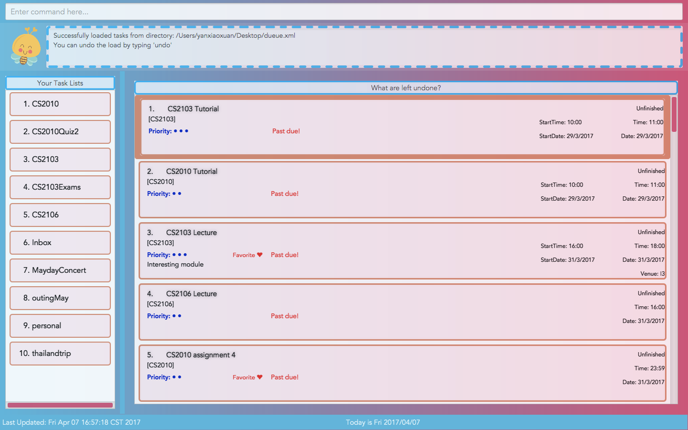

# Dueue - User Guide

By : `Team CS2103JAN2017-W10-B1`  &nbsp;&nbsp;&nbsp;&nbsp; Since: `Feb 2017`  &nbsp;&nbsp;&nbsp;&nbsp; Licence: `MIT`

---

1. [Quick Start](#1-quick-start)
2. [Features](#2-features)
3. [FAQ](#3-faq)
4. [Command Summary](#4-command-summary)

## 1. Quick Start

0. Ensure you have Java version `1.8.0_60` or later installed in your Computer. 

   > Having any Java 8 version is not enough.  
   > This app will not work with earlier versions of Java 8.

1. Download the latest `dueue.jar`, `config.json` and `preferences.json` from the [releases](../../../releases) tab.
2. Copy the file to the folder you want to use as the home folder for your Dueue.
3. Double-click the `dueue.jar` file to start the app. The GUI should appear in a few seconds.
   > 

4. Type the command in the command box and press <kbd>Enter</kbd> to execute it.  
   e.g. typing **`help`** and pressing <kbd>Enter</kbd> will open the help window.
5. Some example commands you can try:
   * **`list`** : lists all the unfinished tasks
   * **`add`**`  add laundry due/sunday dueT/16:00 #personal d/wash clothes p/trivial @B1 *f` :
     adds a task to Dueue named `laundry` which is due on `sunday` at `16:00` under list `personal` with description `wash clothes` at venue `B1` with priority `trivial` and star it as `favorite`.
   * **`delete`**` 3` : deletes the task with index 3 as shown in the current list
   * **`exit`** : exits the app
6. Refer to the [Features](#2-features) section below for details of each command. 

## 2. Features

> **Command Format**
>
> * Words in `UPPER_CASE` are the parameters.
> * Items in `SQUARE_BRACKETS` are optional.
> * Items with `...` after them can have multiple instances.
> * Parameters can be in any order unless otherwise stated.

### 2.1. Viewing help : `help`

View specific help messages 
Format: `help COMMAND_KEYWORD`

> * The relevent help message of the command will be displayed in result display box.
> * Every time when launching the Dueue app, a brief help message will be displayed.
> * The specific help message is also shown if you enter an incorrect command e.g. `delete INVALID_TASK_INDEX`

Examples:

*`help add` 
  Display help message of add command for the user.

### 2.2. Adding a typical task: `add`

Add a task to Dueue 
Format: `add TASKNAME [due/DATE] [dueT/TIME] [#LIST] [d/DESCRIPTION] [@VENUE] [p/PRIORITY] [*f]`

> * A floating task can be added when TASKNAME is the only field specified.
> * The required field for a typical task is TASKNAME, which must be entered as the first field, while other fields are optional and can be entered in random sequence.
> * TASKDATE can be entered in various formats, including "dd/mm", "dd/mm/yyyy", "today/tmr/tomorrow" and "Mon/Monday" with case-insensitive. When a task passes due, a red label will be displayed on the task card.
> * TIME should be in the format of "hh:mm".
> * If `[#LIST]` is not specified, the task will be automatically categorized under the default list "Inbox". If given LIST is not an existing list name, a new LIST will be created and displayed in Dueue.
> * PRIORITY should be in the format of "3/2/1" (from most importance to least importance), or equivalently "important/normal/trivial"
> * User can mark a task as favorite by specifying the field [*f]. Favorite tasks can be viewed using the [list favorite command](https://github.com/CS2103JAN2017-W10-B1/main/blob/master/docs/UserGuide.md#28-listing-all-tasks--list).
> * Task list will automatically scroll to the newly added task.

Examples:

* `add laundry due/01/05 #personal d/wash clothes @B1 *f` 
  Add a task with taskname `laundry` due on `01/05` under the list `personal` with description `wash clothes` at the venue `B1` and mark it as favorite.
* `add CS2103 lecture due/01/02 dueT/16:00 #study d/go for lecture p/3 @iCube` 
  Add a task with taskname `CS2103 lecture` due on `01/02` at time `16:00` under the list `study` with description `go for lecture` at the venue `iCube` with priority level `IMPORTANT`.

### 2.3. Adding an event: `add`

Add an event to Dueue 
Format: `add TASKNAME due/DUEDATE [dueT/DUETIME] [start/STARTDATE] [startT/STARTTIME] [#LISTNAME] [d/DESCRIPTION] [@VENUE] [p/PRIORITY] [*f]`

> * All constraints applied to adding a task also applies to adding an event.
> * Due date must be specified for Dueue to identify this task as an event.
> * Either start date or start time must be specified for Dueue to identify this task as an event.
> * Start time is optional, however it is considered valid only when a due time is specified.
> * Start date must not be later than due date.

Examples:

* `add CS2103 Lecture due/24/05 start/24/05 startT/16:00 dueT/18:00 #CS2103 d/Interesting module @I3 p/3 *f` 
  Add a event with taskname `CS2103 Lecture` on `24/05` with starting time `16:00` to ending time `18:00` under the list `CS2103` with description `Interesting module` at the venue `I3` and mark it as favorite.

### 2.4 Adding a recurring task: `add`

Add a recurring task/event to Dueue 
Format: `add TASKNAME f/FREQUENCY [due/DUEDATE] [dueT/DUETIME] [#LISTNAME] [d/DESCRIPTION] [@VENUE] [p/PRIORITY] [*f]`

> * A recurring frequency must be included for Dueue to identify this task as recurring.
> * Valid FREQUENCY includes "day/week/month", accept varying input formats like "week/weekly/every week".
> * All constraints applied to adding a task also applies to adding a recurring task.

Examples:

* `add CS2103 Lecture due/today #CS2103 @I3 f/weekly` 
  Add a recurring task with taskname `CS2103 Lecture` with the first due date `today` under the list `CS2103` that repeats `weekly` at the venue `I3`

### 2.5 Adding a recurring event: `add`

Add a recurring task/event to Dueue 
Format: `add TASKNAME due/DUEDATE f/FREQUENCY [start/STARTDATE] [dueT/DUETIME] [startT/STARTTIME] [#LISTNAME] [d/DESCRIPTION] [@VENUE] [p/PRIORITY] [*f]`

> * Mandatory fields of both the event and recurring task apply to a recurring event.
> * Valid FREQUENCY includes "day/week/month", accept varying input formats like "week/weekly/every week".
> * All other constraints applied to adding an event also applies to adding a recurring event.

Examples:

* `add CS2103 Lecture startT/16:00 dueT/18:00 #CS2103 @I3 f/weekly` 
  Add a recurring event with taskname `CS2103 Lecture` with start time `16:00` to end time `18:00` under the list `CS2103` that repeats `weekly` at the venue `I3`

### 2.6. Finishing a non-recurring task/event : `finish`

Mark a task as finished in Dueue. 
Format: `finish TASK_INDEX`

> * Finishes the task at the specified `TASKINDEX` as displayed in the current list.
> * The index refers to the index number shown in current list view.
> * Each index **must be a positive integer** 1, 2, 3, ...
> * A finished task will automatically dissappeared from curret list view.
> * Finished tasks can be viewed under the "list finished [LIST_INDEX]" command.
> * Finished tasks can also be viewed together with unfinished tasks under the "list [LIST_INDEX] all" command.

Examples:

* `finish 1` 
  Mark the task with index 1 under current list view as finished.

### 2.7. Finishing a recurring task/event : `finish`

Mark a task as finished in Dueue. 
Format: `finish TASK_INDEX`

> * Finishes the recurring task at the specified `TASKINDEX`.  
> * Upon execution, the most recent occurrence of the recurring task/event will be marked as finished. In current list view, task dates will be automatically updated to the next peiod based on its FREQUENCY, i.e. delayed until next day/week/month.

Examples:

* `finish 1` 
  Mark the recurring task with index 1 under current list view as finished.

### 2.8. Listing all tasks : `list`

Shows a list of tasks in Dueue filtered by specifications given 
Format: `list [all/favorite/finished] [LIST_NAME]` 

Shows all unfinished tasks in Dueue 
Format: `list`

Shows all finished tasks in Dueue 
Format: `list finished`

Shows all favorite tasks in Dueue 
Format: `list favorite`

Shows all tasks in Dueue (finished and unfinished) 
Format: `list all`

Shows all unfinished tasks in Dueue 
Format: `list LIST_NAME`

Shows all finished tasks in Dueue 
Format: `list finished LIST_NAME`

Shows all favorite tasks in Dueue 
Format: `list favorite LIST_NAME`

Shows all tasks in Dueue (finished and unfinished) 
Format: `list all LIST_NAME`

> * Specification parameters must be entered following the defined sequence.
> * LIST_NAME entered is treated in a case-insensitive manner.
> * Tasks listed will be sorted based on the following parameters, from the most importance to the least importance: `due date > priority > due time > name > tag`
> * When LIST_NAME is provided, the corresponding LIST namecard will be highlighted in Dueue.

Examples:

* `list` 
  Lists all unfinished tasks
* `list all` 
  Lists all unfinished and finished tasks
* `list work` 
  List all unfinished tasks in list `work`
* `list all work` 
  List all unfinished and finished tasks in list `work`
* `list finished inbox` 
  List all finished tasks in list `inbox`
* `list favorite study` 
  List all favorite tasks in list `study`

### 2.9. Editing a task : `edit`

Edits existing task in Dueue 
Format: `edit TASKINDEX [n/TASKNAME] [due/DUEDATE] [dueT/TIME] [#LIST] [d/DESCRIPTION] [@VENUE] [p/PRIORITY] [*f/*u] [f/FREQUENCY]`

> * Edits the task at the specified `INDEX`.
> * The index refers to the index number shown in the current list view. 
> * The index **must be a positive integer** 1, 2, 3, ...
> * At least one of the optional fields must be provided.
> * A field will be updated only if the given details does not violate task constraints.
> * For the field "favorite", use "*f" to mark as favorite and use "*u" to unfavorite a task.
> * If FREQUENCY is specified, a non-recurring task will be changed into a recurring task.
> * Existing values will be edited to the input values.
> * You can remove the content of a specific field by typing the field prefix only, e.g.`edit TASK_INDEX due/`.
> * Specification of fields for task can be entered in any order.

Examples:

* `edit 1 Laundry due/10/01 @` 
  Edits the name and due date of the task with `INDEX` 1 to be `Laundry`, `10/01` and remove the venue.

* `edit 2 due/ *u` 
  Remove the due date of the task with `INDEX` 2 and make it not a favorite.

* `edit 3 f/month` 
  Change the event with `INDEX` 3 into a recurring task that repeats every `month`.

### 2.10. Edit an event : `edit`

Edits existing event in Dueue 
Format: `edit TASKINDEX [n/NAME] [startT/STARTTIME] [dueT/STARTDATE] [due/DUEDATE] [dueT/DUETIME] [#LIST] [d/DESCRIPTION] [@VENUE] [p/PRIORITY] [*f/*u]`

> * A field will be updated only if the given details does not violate event constraints (e.g. STARTDATE should be no later than the DUEDATE).
> * If FREQUENCY is specified, a non-recurring event will be changed into a recurring event.

Examples:

* `edit 1 Laundry due/10/01 @` 
  Edits the name, due date of the task with `INDEX` 1 to be `Laundry`, `10/01` respectively, and remove its venue.

* `edit 2 start/tmr *u` 
  Edits the start date of the task with `INDEX` 2 into `tmr` and make it not a favorite.

* `edit 3 f/weekly` 
  Edits the event with `INDEX` 3 into a recurring event that repeats `weekly`.

### 2.11. Edit next recurring task/event : `edit next/t`

Edit the most recurrence of a recurring task/event 
Format: `edit next/t TASKINDEX [n/NAME] [due/DUEDATE] [dueT/TIME] [start/STARTDATE] [startT/STARTTIME] [#LIST] [d/DESCRIPTION] [@VENUE] [p/PRIORITY] [*f/*u]`

> * This command only applies to recurring tasks/events.
> * All constraints applied to editing non-recurring tasks/events also applies.
> * Editions will only apply to the most recent occurence of the task/event as specified by the INDEX given.
> * Upon execution, the most recent occurence will be seperated from the previous set of recurring task/event, whose date/time will be increased by one period.

* `edit 3 d/need to include ABC` 
  Edits the next occurrence of the recurring task/event with `INDEX` 3 to be of description `need to include ABC`. Effectively, a non-recurring task/event with the description changed to `need to include ABC` is added and the current recurring task/event is finished once.

### 2.12. View certain tasks: `view`

View tasks due on today. 
Format: `view`

View tasks due on a specified date / N days later. 
Format: `view on/NUMBEROFDAYS`
        `view on/DATE`

View tasks due within a specific date / the next N days. 
Format: `view next/NUMBEROFDAYS`
        `view next/DATE`
        `view by/NUMBEROFDAYS`
        `view by/DATE

> * When no parameters are given, Dueue will show the tasks due on today.
> * `view on/today` is equivalent to `view on/0`.
> * NUMBEROFDAYS must be a non-negative integer.
> * Date must not be earlier than today. It accepts varying formats, including "dd/mm", "dd/mm/yyyy", "today/tmr/tomorrow" and "Mon/Monday".
> * Tasks listed under view command will be sorted based on the following parameters, from the most importance to the least importance: `due date > priority > due time > name > tag`

Examples:

* `view on/today` 
  Returns a list of unfinished tasks due on today
* `view next/Monday` 
  Returns a list of unfinished tasks due by next Monday

### 2.13. Deleting a task : `delete`

Deletes the specified task from Dueue. 
Format: `delete TASKINDEX`

> * Deletes the task at the specified `TASKINDEX`.
> * The index refers to the index number shown in the most recent listing.
> * Each index **must be a positive integer** 1, 2, 3, ...
> * Index cannot exceed the length of current list view.

Examples:

* `delete 2` 
  Deletes the 2nd task in current list view.

### 2.14. Undo latest command: `undo`

Undo the immediately preceding undoable command. 
Format: `undo`

> * Undoable commands include `add`, `delete`, `edit`, `finish`, `clear` and `load`.
> * When the latest undoable command is undone, a success message will be shown, while the latest command is reversed.

Examples:

* `undo` 
  Undo the previous command.

### 2.15. Reverse previous `undo` command: `redo`

Reverse the immediately preceding undo command. 
Format: `redo`

> * Reverse `undo` command if user made a mistake.
> * Can only redo when there is any undone command.

Examples:

* `redo` 
  Previous `undo` command is reversed.

### 2.16. Load file: `load`

Load external XML file into Dueue. 
Format: `load FILEPATH`

> * The path must trace to an XML file.
> * For MAC users, use `/` at the start of FILEPATH to indicate absolute/root directory, otherwise the path will be read as relative directory.

Example:

* `load /Users/Alice/Desktop/sampleTasks.xml` in Mac OS X 
  Load tasks from the given filepath.

* `load C:\Alice\Desktop\sampleTasks.xml` in Windows 
  Load tasks from the given filepath.

* `load data.xml` 
  Load tasks from the `data.xml` file located in the same directory as the application.

### 2.17. Find tasks: `find`

Find a list of all/finished/unfinished tasks containing given keywords. 
Format: `find [all/finished/unfinished] [KEYWORD...]`

> * Only task(s) whose names contain any of the KEYWORD given fully will be listed.
> * Matching of the keywords is treated in a case-insensitive manner.
> * Tasks listed under find command will be sorted based on the following parameters, from the most importance to the least importance: `due date > priority > due time > name > tag`

Example:

* `find finished CS2103` 
  Find all finished tasks whose name contains "CS2103".

### 2.18. Scroll to : `scroll`

Scroll to a given index in Dueue. 
Format: `scroll INDEX`

> * Index must be a positive integer no bigger than current length of list view.

Example:

* `scroll 3` 
  Scroll to the task card with index 3.

### 2.19. Exiting the program : `exit`

Exits the program. 
Format: `exit`

### 2.20. Saving the data

Dueue data are saved in the hard disk automatically after any command that changes the data. 
There is no need to save manually.

## 3. FAQ

**Q**: How do I transfer my data to another Computer? 
**A**: Install the app in the other computer and overwrite the empty data file it creates with
       the file that contains the data of your previous Dueue folder.

## 4. Command Summary

* **Add**  `add n/TASKNAME [due/DUEDATE] [dueT/TIME] [#LISTNAME] [d/DESCRIPTION] [@VENUE] [p/PRIORITY] [*f]`  
  e.g. `add CS2103 lecture due/01/02 dueT/16:00 #study d/go for lecture p/3 @iCube`

* **Clear** : `clear`
  e.g. `clear`

* **Delete** : `delete TASKINDEX...`  
   e.g. `delete 3`

* **Edit** : `edit TASKINDEX [n/NAME] [startT/STARTTIME] [dueT/STARTDATE] [due/DUEDATE] [dueT/DUETIME] [#LIST] [d/DESCRIPTION] [@VENUE] [p/PRIORITY] [*f/*u]`  
  e.g.`edit 1 Laundry due/10/01 @`

* **Finish** : `finish TASKINDEX`  
   e.g. `finish 5`

* **Help** : `help COMMAND_KEYWORD`  
  e.g. `help add`

* **List** : `list [all/favorite/finished] [LIST_NAME]`  
  e.g. `list favorite work`

* **Load** : `load FILEPATH`  
  e.g. `load data/sampleTasks.xml`

* **Redo** : `redo`  
  e.g. `redo`

* **Undo** : `undo`  
  e.g. `undo`

* **View** : `view DUETYPE/NUMBEROFDAYS` `view DUETYPE/DATE` 
  e.g. `view by/7` `view on/tmr`
